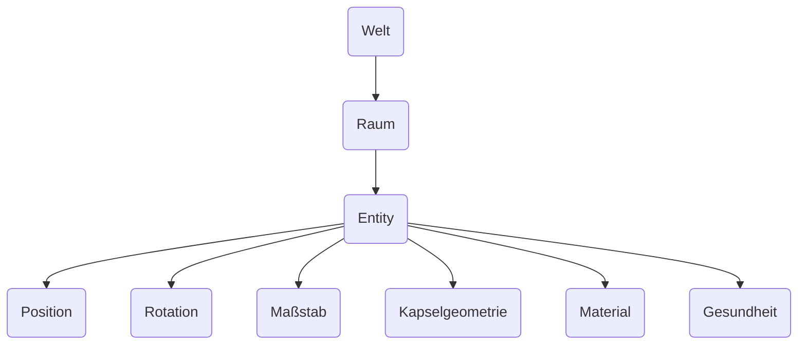

# Entitäten und Komponenten

## Einführung

{frontMatter.description} Eine Entität stellt ein bestimmtes Objekt in Ihrer Spielwelt dar, während Komponenten die spezifischen Daten oder Funktionen definieren, über die Entitäten verfügen. Dieses Design ermöglicht einen flexiblen und modularen Aufbau komplexer Systeme durch die Kombination verschiedener Komponenten mit unterschiedlichen Einheiten.

## Beziehungen

Entitäten und Komponenten arbeiten in hierarchischer Weise zusammen. Eine Entität ist im Wesentlichen ein Bezeichner, der mit einer oder mehreren Komponenten verbunden sein kann. Komponenten enthalten die eigentlichen Daten oder die Logik, die definieren, was eine Entität tun kann oder wie sie sich verhält. Indem Sie Entitäten aus verschiedenen Komponenten zusammensetzen, können Sie vielfältige und komplexe Spielobjekte erstellen, ohne dass starre Vererbungsstrukturen erforderlich sind.

### Beispiel

Eine Entität existiert in einem Raum, der einer Welt gehört. Die Welt stellt die übergreifende Umgebung oder den Kontext dar, während Räume Entitäten zusammenfassen. Eine Welt könnte zum Beispiel eine Spielebene enthalten, wobei die Räume verschiedene Bereiche oder Szenen organisieren. Entitäten in jedem Raum können Komponenten wie Position, Drehung, Skalierung, Zustand, Geometrie und Material haben. Jede Komponente definiert ein bestimmtes Merkmal oder Verhalten der Entität und ermöglicht eine modulare Kontrolle über ihre Attribute.

