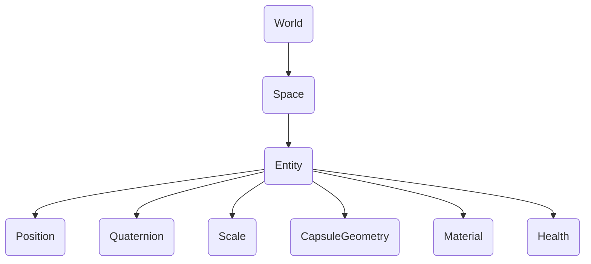

# Übersicht

## Einführung

{frontMatter.description}

Eine Entität existiert in einem Raum, der einer Welt gehört. Die Welt stellt die übergreifende Umgebung oder den Kontext dar, während Räume Entitäten zusammenfassen. Eine Welt könnte zum Beispiel eine Spielebene enthalten, wobei die Räume verschiedene Bereiche oder Szenen organisieren. Entitäten in jedem Raum können Komponenten wie Position, Drehung, Skalierung, Zustand, Geometrie und Material haben. Jede Komponente definiert ein bestimmtes Merkmal oder Verhalten der Entität und ermöglicht eine modulare Kontrolle über ihre Attribute.

## Welt {#world}

Eine Welt ist der Container für alle Räume/Entitäten und stellt APIs für [Audio](/api/studio/world/audio), [Ereignisse](/api/studio/world/events/), [3D-Transformationen](/api/studio/world/transform/) und mehr zur Verfügung.

## Weltraum

Ein Raum ist eine Gruppe von Entitäten. Sie enthält auch globale Einstellungen für Funktionen wie Nebel, Himmelskörper und eingeschlossene Räume, die aktiviert werden, wenn der Raum geladen wird. Mehr unter [Spaces](/studio/guides/spaces/).

## Entitäten

Entities sind 3D-Objekte, die das Rückgrat eines jeden Spiels oder einer Simulation in 8th Wall Studio bilden. Eine Entität an sich hat kein Verhalten oder Aussehen; sie fungiert lediglich als Container, an den Komponenten angehängt werden können. Entitäten werden durch eine eindeutige 64-Bit-Ganzzahl dargestellt, die als Entitäts-ID oder eid bezeichnet wird. Weitere Informationen finden Sie unter [Entitäten](/studio/guides/entities/).

## Komponenten

Komponenten sind die Bausteine, die Entitäten ihre Funktionalität verleihen. Während eine Entität ein leeres Objekt darstellt, können Sie in 8th Wall Studio integrierte Komponenten verwenden oder Ihre eigenen Komponenten erstellen, um einzigartige Verhaltensweisen für Ihr Spiel zu definieren. Komponenten können das visuelle Erscheinungsbild, die physikalischen Eigenschaften, die Eingabeverarbeitung oder die benutzerdefinierte Spiellogik definieren. Durch die Kombination mehrerer Komponenten können Sie komplexe Entitäten mit vielfältigem Verhalten erstellen.

## Beziehungen

Entitäten und Komponenten arbeiten in hierarchischer Weise zusammen. Indem Sie Entitäten aus verschiedenen Komponenten zusammensetzen, können Sie vielfältige und komplexe Spielobjekte erstellen, ohne dass starre Vererbungsstrukturen erforderlich sind.
