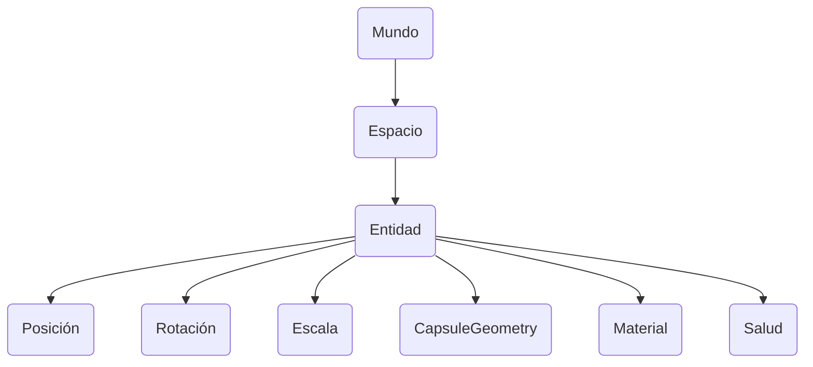

# Entidades y componentes

## Introducción

{frontMatter.description} Una entidad representa un objeto distinto en tu mundo de juego, mientras que los componentes definen los datos específicos o la funcionalidad que poseen las entidades. Este diseño permite construir sistemas complejos de forma flexible y modular combinando varios componentes con distintas entidades.

## Relaciones

Las entidades y los componentes trabajan juntos de forma jerárquica. Una entidad es esencialmente un identificador que puede tener uno o más componentes asociados. Los componentes contienen los datos reales o la lógica que define lo que una entidad puede hacer o cómo se comporta. Al componer entidades a partir de distintos componentes, se pueden crear objetos de juego diversos y complejos sin necesidad de estructuras de herencia rígidas.

### Ejemplo

Una entidad existe dentro de un espacio, que es propiedad de un mundo. El mundo representa el entorno o contexto general, mientras que los espacios agrupan entidades. Por ejemplo, un mundo podría contener un nivel de juego, con espacios que organizaran diferentes áreas o escenas. Las entidades dentro de cada espacio pueden tener componentes como posición, rotación, escala, salud, geometría y material. Cada componente define una característica o comportamiento distinto de la entidad, lo que permite un control modular de sus atributos.

