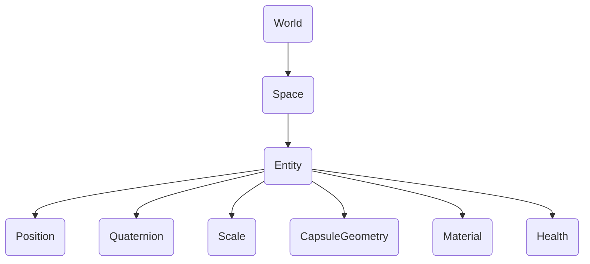

# Descripción general

## Introducción

{frontMatter.description}

Una entidad existe dentro de un espacio, que es propiedad de un mundo. El mundo representa el entorno o contexto general, mientras que los espacios agrupan entidades. Por ejemplo, un mundo podría contener un nivel de juego, con espacios que organizaran diferentes áreas o escenas. Las entidades dentro de cada espacio pueden tener componentes como posición, rotación, escala, salud, geometría y material. Cada componente define una característica o comportamiento distinto de la entidad, lo que permite un control modular de sus atributos.

## Mundo {#world}

Un Mundo es el contenedor de todos los espacios/entidades, y expone APIs para [audio](/api/studio/world/audio), [eventos](/api/studio/world/events/), [transformaciones 3D](/api/studio/world/transform/), y más.

## Espacio

Un Espacio es un conjunto de Entidades. También contiene ajustes globales para características como niebla, skybox y espacios incluidos que se activan cuando se carga el espacio. Más información en [Spaces](/studio/guides/spaces/).

## Entidades

Las entidades son objetos 3D que forman la columna vertebral de cualquier juego o simulación en 8th Wall Studio. Una entidad por sí misma no tiene comportamiento ni apariencia; simplemente actúa como un contenedor al que se pueden adjuntar componentes. Las entidades se representan mediante un número entero único de 64 bits denominado ID de entidad o eid. Más información en [Entidades](/studio/guides/entities/).

## Componentes

Los componentes son los bloques de construcción que dan a las entidades su funcionalidad. Mientras que una entidad representa un objeto en blanco, en 8th Wall Studio puedes utilizar Componentes incorporados o crear tus propios Componentes personalizados para definir comportamientos únicos para tu juego. Los componentes pueden definir el aspecto visual, las propiedades físicas, la gestión de las entradas o la lógica de juego personalizada. Combinando varios Componentes, puede crear entidades complejas con un comportamiento rico.

## Relaciones

Las entidades y los componentes trabajan juntos de forma jerárquica. Al componer entidades a partir de distintos componentes, se pueden crear objetos de juego diversos y complejos sin necesidad de estructuras de herencia rígidas.
