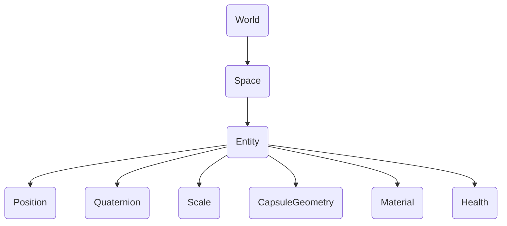

# Aperçu

## Introduction

{frontMatter.description}

Une entité existe dans un espace qui appartient à un monde. Le monde représente l'environnement ou le contexte général, tandis que les espaces regroupent les entités. Par exemple, un monde peut contenir un niveau de jeu, avec des espaces organisant différentes zones ou scènes. Les entités de chaque espace peuvent avoir des composantes telles que la position, la rotation, l'échelle, la santé, la géométrie et la matière. Chaque composant définit une caractéristique ou un comportement distinct de l'entité, ce qui permet un contrôle modulaire de ses attributs.

## Monde {#world}

Un monde est le conteneur de tous les espaces/entités et expose des API pour [audio](/api/studio/world/audio), [événements](/api/studio/world/events/), [transformations 3D](/api/studio/world/transform/), et plus encore.

## L'espace

Un espace est un groupe d'entités. Il contient également des paramètres globaux pour des fonctionnalités telles que le brouillard, la boîte à ciel et les espaces inclus qui sont activés lorsque l'espace est chargé. Voir plus dans [Espaces](/studio/guides/spaces/).

## Entités

Les entités sont des objets 3D qui constituent l'épine dorsale de tout jeu ou simulation dans 8th Wall Studio. Une entité en soi n'a pas de comportement ni d'apparence ; elle agit simplement comme un conteneur auquel des composants peuvent être attachés. Les entités sont représentées par un nombre entier unique de 64 bits appelé ID d'entité ou eid. Voir aussi [Entités](/studio/guides/entities/).

## Composants

Les composants sont les éléments constitutifs qui confèrent aux entités leur fonctionnalité. Alors qu'une entité représente un objet vide, dans 8th Wall Studio, vous pouvez utiliser des composants intégrés ou créer vos propres composants personnalisés pour définir des comportements uniques pour votre jeu. Les composants peuvent définir l'apparence visuelle, les propriétés physiques, la gestion des entrées ou la logique de jeu personnalisée. En combinant plusieurs composants, vous pouvez créer des entités complexes au comportement riche.

## Les relations

Les entités et les composants fonctionnent ensemble de manière hiérarchique. En composant des entités à partir de différents éléments, vous pouvez construire des objets de jeu divers et complexes sans avoir besoin de structures d'héritage rigides.
