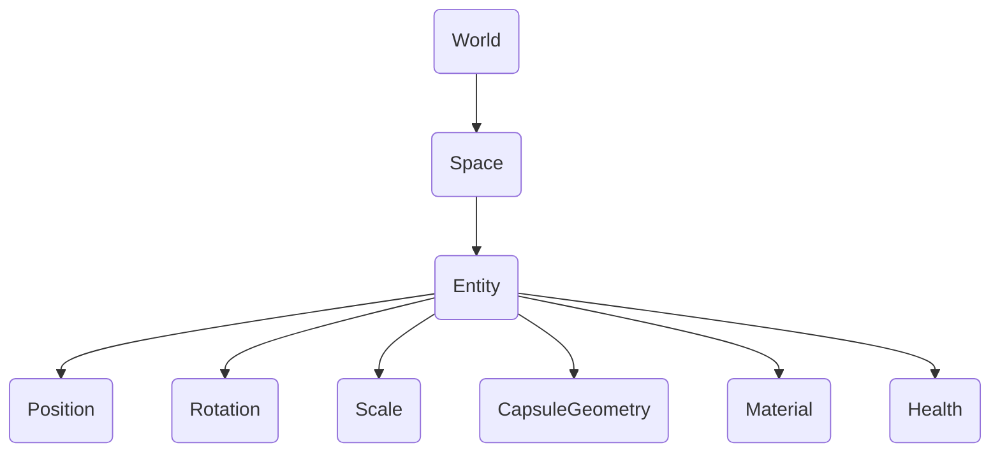

# エンティティとコンポーネント

## はじめに

{frontMatter.description} コンポーネントは、エンティティが持つ特定のデータや機能を定義します。 この設計により、様々なコンポーネントを異なるエンティティと組み合わせることで、複雑なシステムを柔軟かつモジュール式に構築することができる。

## 人間関係

エンティティとコンポーネントは階層的に連携する。 エンティティは基本的に識別子であり、1つ以上のコンポーネントを関連付けることができる。 コンポーネントには、エンティティに何ができるか、どのように動作するかを定義する実際のデータやロジックが含まれます。 異なるコンポーネントからエンティティを構成することで、厳格な継承構造を必要とせずに、多様で複雑なゲームオブジェクトを構築することができます。

### 例

エンティティは、ワールドが所有する空間の中に存在する。 世界は包括的な環境やコンテクストを表し、スペースはエンティティをグループ化する。 例えば、ワールドはゲームレベルを含み、スペースは異なるエリアやシーンを構成する。 各スペース内のエンティティは、位置、回転、スケール、ヘルス、ジオメトリ、マテリアルなどのコンポーネントを持つことができる。 各コンポーネントは、エンティティの明確な特性や動作を定義し、その属性のモジュール制御を可能にする。

