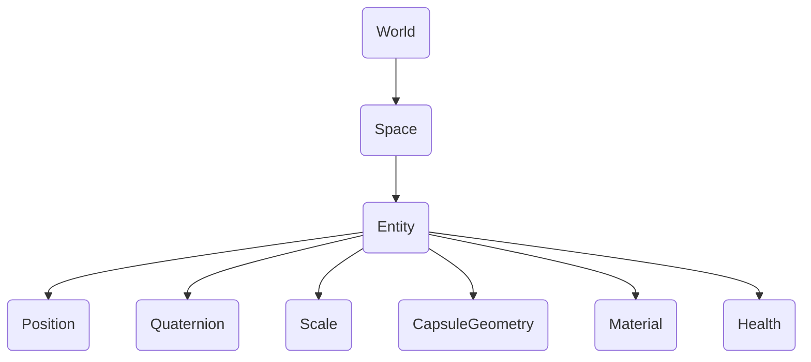

# 概要

## はじめに

{frontMatter.description}

エンティティは、ワールドが所有する空間の中に存在する。 世界は包括的な環境やコンテクストを表し、スペースはエンティティをグループ化する。 例えば、ワールドはゲームレベルを含み、スペースは異なるエリアやシーンを構成する。 各スペース内のエンティティは、位置、回転、スケール、ヘルス、ジオメトリ、マテリアルなどのコンポーネントを持つことができる。 各コンポーネントは、エンティティの明確な特性や動作を定義し、その属性のモジュール制御を可能にする。

## 世界 {#world}

ワールドはすべてのスペース/エンティティのコンテナであり、[オーディオ](/api/studio/world/audio)、[イベント](/api/studio/world/events/)、[3Dトランスフォーム](/api/studio/world/transform/)などのAPIを公開しています。

## スペース

スペースはエンティティのグループである。 また、フォグ、スカイボックス、スペースがロードされたときに有効になるインクルードスペースなどの機能のグローバル設定も含まれています。 詳しくは[スペース](/studio/guides/spaces/)で。

## エンティティ

エンティティは、8th Wall Studioのゲームやシミュレーションの骨格となる3Dオブジェクトです。 エンティティは、それ自体では動作や外観を持たず、単にコンポーネントをアタッチできるコンテナとして機能する。 エンティティは、エンティティIDまたはeidと呼ばれる一意の64ビット整数で表される。 詳しくは[Entities](/studio/guides/entities/)を参照。

## コンポーネント

コンポーネントは、エンティティに機能を与えるビルディング・ブロックである。 エンティティは空白のオブジェクトを表しますが、8th Wall Studioでは、組み込みコンポーネントを使用したり、独自のカスタムコンポーネントを作成して、ゲームのユニークな動作を定義することができます。 コンポーネントは、視覚的な外観、物理的なプロパティ、入力処理、またはカスタムゲームロジックを定義することができます。 複数のコンポーネントを組み合わせることで、リッチな動作を持つ複雑なエンティティを作成できます。

## 人間関係

エンティティとコンポーネントは階層的に連携する。 異なるコンポーネントからエンティティを構成することで、厳格な継承構造を必要とせずに、多様で複雑なゲームオブジェクトを構築することができます。
